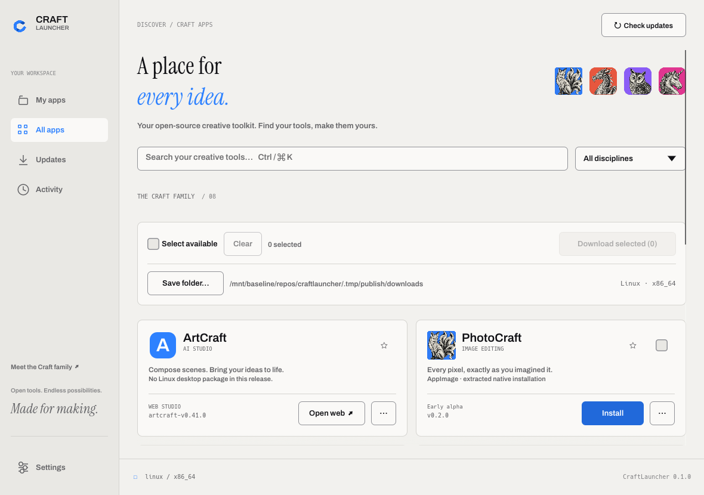
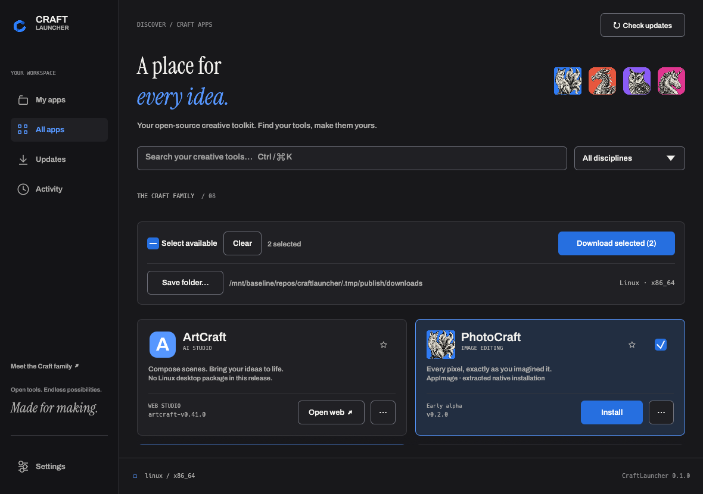
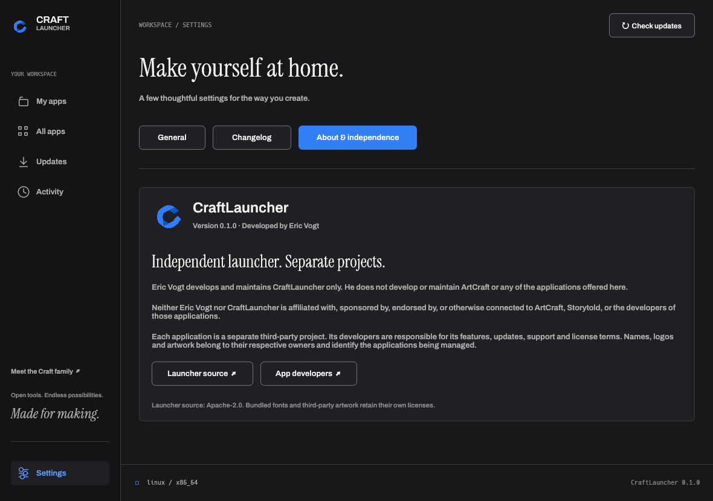
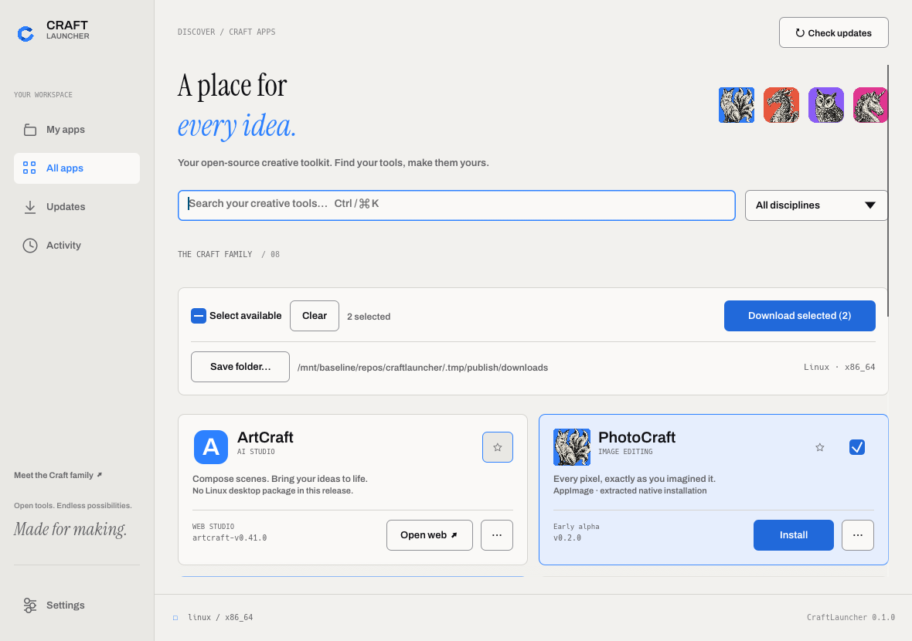

<p align="center">
  
</p>

# CraftLauncher

Your creative tools, ready to launch.

[Build status](https://github.com/EricVogt93/artcraft-launcher/actions/workflows/ci.yml) · [Build artifacts](https://github.com/EricVogt93/artcraft-launcher/actions/workflows/ci.yml) · [Build from source](#run) · [Changelog](CHANGELOG.md) · [Contributing](CONTRIBUTING.md)


A native Rust toolbox for the [ArtCraft family](https://github.com/storytold). Install, launch, update and manage ArtCraft, PhotoCraft, VectorCraft, FilmCraft, LightCraft, PrintCraft, EffectCraft and DesignCraft in one desktop app.

The UI follows ArtCraft's warm paper colors, blue accent, Archivo lettering and Instrument Serif headings. It uses **Rust 2024, eframe/egui 0.36, wgpu and rfd**, with no Electron, embedded browser or web UI.

## See it in action

| Your workspace | Preview |
| --- | --- |
| **Light mode**<br>Warm paper colors, clear controls and the whole Craft family. | <a href="docs/launcher-light.png"></a> |
| **Dark mode**<br>The same native workspace, with a darker palette. | <a href="docs/launcher-dark.png"></a> |
| **About & independence**<br>Launcher authorship and the separation from third-party applications are explicit. | <a href="docs/launcher-about.png"></a> |
| **Download several apps**<br>Select available packages, choose a folder and download for your detected OS and CPU. | <a href="docs/launcher-batch.png"></a> |

## Run

```sh
cargo run --locked --bin craftlauncher
```

Rust 1.95 or newer is required. On Linux/FreeBSD, install X11 or Wayland libraries, a working OpenGL/Vulkan graphics driver, D-Bus and `xdg-desktop-portal` for file dialogs. The tray uses StatusNotifierItem on Linux/FreeBSD and native platform menus on Windows/macOS. If no tray watcher exists, closing the window quits normally.

For an optimized build:

```sh
cargo build --locked --release --bins
./target/release/craftlauncher
```

`--help` lists the headless management commands. Use `--data-dir /absolute/path` for an isolated library. The default library is the OS's per-user local data directory; apps never require administrator privileges.

## What is implemented

- My apps, All apps, Updates, Activity and Settings; search, discipline filters, favorites, release notes and version selection (explicit installs are pinned).
- App checkboxes, select all available packages, batch downloads for the automatically detected OS/CPU, native save-folder selection and a remembered destination. Package downloads do not install apps or overwrite different existing files.
- Stable/Preview channels globally and per app; version pins and global/per-app automatic-update control.
- GitHub releases with ETag caching, offline metadata, exact OS/architecture selection and SHA-256 verification.
- Managed installations, native launching, desktop shortcuts, external-installation linking, uninstall/unlink, previous-version rollback and deferred activation while apps run.
- Linux AppImages are extracted once into the managed library. A stable entry in `~/.local/bin` and a per-user `.desktop` entry with the app icon make them available to KDE Plasma and GNOME application search, without FUSE at launch.
- Automatic checks at startup and every six hours; verified app updates activate when the app closes. Downloads can be cancelled without replacing the installed version.
- Native tray, login startup, desktop notifications, Light/Dark/System themes and single-instance foreground activation.
- Settings tabs for general preferences, the launcher changelog and an explicit developer/project independence statement.
- A **local, signed launcher update feed**, separate update helper, stable bootstrap entry point, first-frame health acknowledgement and automatic recovery if the new launcher fails to start. A failed version is quarantined from automatic retries; an explicit manual check can retry it.
- Atomic JSON persistence, exclusive library locking, preservation of damaged-state files and cleanup of interrupted downloads.

App availability follows actual upstream release assets. An app without a compatible published package stays unavailable; you can still open its source or link an existing installation. ArtCraft's hosted studio opens in your browser. WebAssembly builds are downloadable links, not an embedded launcher interface.

## Platforms and packages

| Target | Distribution | Runtime qualification here |
| --- | --- | --- |
| Linux x86_64 | tar.gz, optional deb/rpm/AppImage | X11 and Wayland checked locally |
| Linux ARM64 | tar.gz, optional deb/rpm/AppImage | Native CI target; see Actions |
| Windows x86 / x64 / ARM64 | portable ZIP, per-user NSIS installer | Native CI target; see Actions |
| macOS Intel + Apple Silicon | universal .app, DMG, update tar.gz | Native CI target; see Actions |
| FreeBSD x86_64 | tar.gz | VM Native CI target; see Actions |

Target baselines: Windows 10/11 (ARM64: Windows 11), macOS 11+, Linux glibc 2.35+, FreeBSD 14.3+. These are packaging targets, not a claim that every OS release and graphics driver is qualified. See [validation](docs/VALIDATION.md) and [release operations](docs/RELEASES.md).

For the portable Linux package, use `target/portable-linux/release/craftlauncher` or the archives in `target/packages`. The reproducible baseline build is defined in `packaging/Dockerfile.linux`.

To download several packages without installing them:

```sh
./target/portable-linux/release/craftlauncher --download photocraft,vectorcraft --save-folder /path/to/downloads
```

In the UI, check the app cards (or **Select available**), choose **Save folder…**, then click **Download selected**. The displayed OS/CPU is detected automatically; incompatible published packages cannot be selected.

Linux installs prefer an AppImage for the detected architecture and fall back to a tar archive. **Install** extracts the package and registers the native app; **Download selected** saves the original packages. Desktop entries live in `$XDG_DATA_HOME/applications` (normally `~/.local/share/applications`). Existing unmanaged commands and desktop entries are preserved. `CRAFTLAUNCHER_BIN_DIR` can override the absolute bin directory for an isolated installation.

In **Settings → Updates**, **Automatically update installed apps** controls automatic downloads and activation of prepared automatic updates. Per-app settings and version pins still apply; manual installs remain available. The setting persists across restarts. The equivalent CLI command is `craftlauncher --auto-updates off` or `on`. Launcher updates have their own separate option.

## CI and repository workflow

Pull requests into `main` run format/lint checks, unit and lifecycle tests, and native builds for Linux x86_64/ARM64, Windows x86/x64/ARM64, macOS Intel/Apple Silicon and FreeBSD x86_64. After merge, `main` builds everything again and uploads installers, portable archives, SHA-256 sums and unsigned update manifests as 30-day Actions artifacts. macOS ships a universal application and DMG. The separate manual qualification workflow exercises native graphics and update recovery.

`development` → `staging` → `main` is the promotion path. `main` requires an approving PR review and a passing **All platforms** check; it blocks direct pushes, force pushes and deletion. `staging` and `development` have deletion and force-push protection. See [contribution guidelines](CONTRIBUTING.md) and [release operations](docs/RELEASES.md).

## Local launcher updates

Generate keys outside the source tree:

```sh
./target/release/craftlauncher --generate-update-key /secure/local-keys
python3 scripts/package.py --binaries target/release --output /tmp/craftlauncher-feed \
  --version 0.2.0 --target linux-x86_64
./target/release/craftlauncher --sign-manifest /tmp/craftlauncher-feed/manifest-linux-x86_64-stable.json \
  --signing-key /secure/local-keys/update-private.key
```

The payload **must actually be built with that version**. For development feeds, build with `CRAFTLAUNCHER_BUILD_VERSION=0.2.0 cargo build --release --bins`. A label on an old executable will fail the health check and roll back.

Select the feed folder and the hexadecimal public key in Settings. The launcher verifies Ed25519 signatures and the entire archive, binds extracted executables to its signed contents and prepares updates without modifying the current program. Use Restart to update, or reopen the launcher to activate a prepared update. No public update endpoint, remote publishing, signing credentials or production release has been configured.

## Validate

```sh
cargo fmt --all --check
cargo clippy --workspace --all-targets -- -D warnings
cargo test --workspace --locked
python3 scripts/native_smoke.py --binary target/debug/craftlauncher
```

The native smoke test runs in the existing desktop session. For headless Linux/FreeBSD, run it under `dbus-run-session -- xvfb-run -a`. `scripts/update_smoke.py` exercises a real helper and launcher payload with a local signed feed; see its help for the two-binary inputs.

Source code is [Apache-2.0](LICENSE), preserving this repository’s original license. See [NOTICE](NOTICE). Bundled typefaces retain their SIL OFL licenses; product icons and screenshots identify their respective upstream apps. See [asset attribution](assets/ATTRIBUTION.md).

Eric Vogt develops only CraftLauncher and is not affiliated with ArtCraft, Storytold or any of the applications it manages. Those applications are developed and supported independently by their respective owners. The repository presentation is inspired by [ArtCraft](https://github.com/storytold/artcraft). The original launcher [logo](assets/craftlauncher-logo.png) and its generation prompt are documented in [branding](assets/BRANDING.md).
