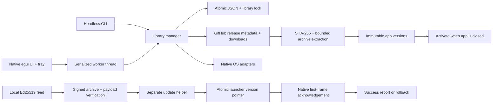

# Architecture

`crates/core` owns the release cache, catalog, persistence, installation lifecycle, process detection, platform integration, background operations and updater. The `Remote` and `Platform` boundaries allow failure-sensitive lifecycle tests without substituting fake outcomes for runtime qualification.

`crates/ui-egui` owns native rendering, fonts, images, navigation, native dialogs and tray. Blocking downloads and process scans stay on the worker. egui's hidden-window `logic` callback continues receiving tray events and requesting repaints.

`apps/craftlauncher` contains the native application, headless CLI, stable bootstrap executable and separate update helper. Existing launch entries redirect through the per-library pointer after a healthy update. Payloads use relative paths inside managed roots; linked external installations retain absolute paths and cannot be overwritten by an install operation.

State is persisted through a temporary file in the destination directory, sync and atomic replacement. Settings and version transitions preserve the previous in-memory state when persistence fails. A damaged JSON document is renamed for recovery; newer schema versions are rejected without rewriting them. No operation searches for or deletes user documents outside the managed app directory.

App archive paths reject absolute paths, traversal, drive letters and backslashes. General symlinks, hardlinks and special files are rejected. macOS archives permit only symlinks that resolve within their containing `.app` bundle. Extraction limits file count, uncompressed size and directory depth. DMG mounting is readonly and guarded by automatic detach; native installer activation is deferred until the installed app is closed.

Linux AppImages use their verified runtime's `--appimage-extract` operation in an isolated staging directory, with cancellation and a timeout. The resulting AppDir is checked for file-count, size and depth limits, escaping symlinks and special files; internal symlinks are retained. Only the extracted AppDir is activated. Launching uses its `AppRun` directly and needs no AppImage mount or FUSE. The stable per-user bin wrapper and freedesktop entry are refreshed on activation and rollback. Registration rejects unmanaged destinations; removal checks both ownership and the exact active executable so another library's newer registration survives.

Automatic app updates carry a persisted automatic/manual origin. Disabling the global app-update setting stops automatic downloads and pauses activation of automatic pending versions, while explicit manual installs continue. Re-enabling resumes eligible updates; per-app switches and pins are also respected.

The GitHub API is the app release authority; checksums authenticate integrity against upstream metadata, not an independent app publisher signature. Launcher releases use a separately configured Ed25519 trust key. Every helper activation rechecks the archive and compares executables to a fresh extraction of the signed archive, including when local state hashes have been modified.
